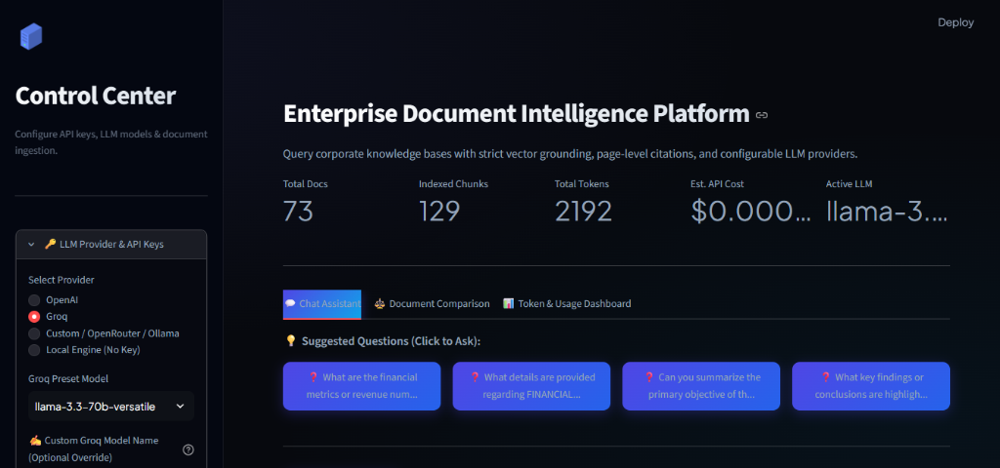
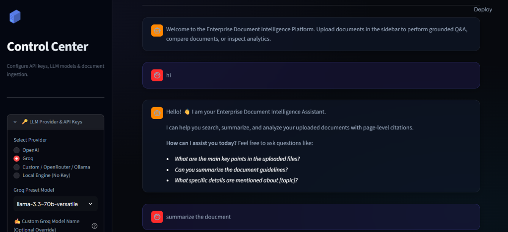
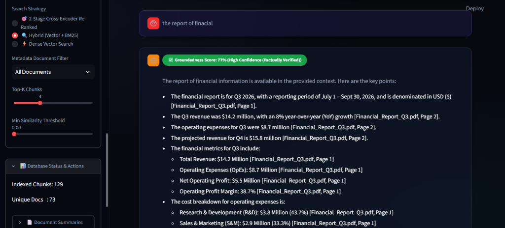
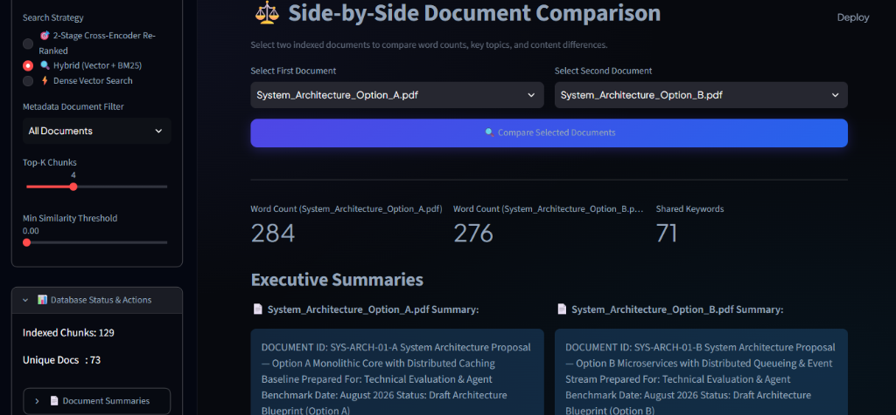
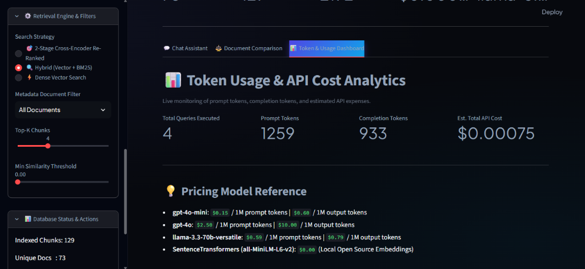

# Enterprise Document Intelligence RAG Platform ⚡

[](https://enterprisedocuments-mykuyzjycbucehracp2jfv.streamlit.app)
[](https://github.com/armishiqbal/Enterprise_Documents)
[](https://python.org)
[](https://fastapi.tiangolo.com)
[](https://streamlit.io)

> 🚀 **Live Interactive Web Application**: [https://enterprisedocuments-mykuyzjycbucehracp2jfv.streamlit.app](https://enterprisedocuments-mykuyzjycbucehracp2jfv.streamlit.app)

An enterprise-grade **Retrieval-Augmented Generation (RAG)** platform designed for intelligent document search, grounded question answering, executive summarization, and side-by-side document comparison. The system combines semantic vector search, BM25 keyword matching, cross-encoder re-ranking, and LLMs (cloud and local) to provide highly accurate, fact-checked responses backed by page-level citations from uploaded documents.

---


## ✨ Features

- 📄 **Multi-Format Document Ingestion**: Upload and process multiple document formats (`.pdf`, `.docx`, `.txt`, `.md`) with structured table extraction using `pdfplumber` and `python-docx`.
- ✂️ **Intelligent Chunking & Preprocessing**: Section-aware recursive character text splitter with stable, deterministic chunk ID tracking and metadata inheritance.
- ⚡ **Dense Vector Search**: High-dimensional semantic retrieval powered by `SentenceTransformers` (`all-MiniLM-L6-v2`) and persistent `ChromaDB` vector storage.
- 🔍 **BM25 Keyword Search**: Okapi BM25 keyword matching with fuzzy typo tolerance for exact terms, acronyms, and technical IDs.
- 🔀 **Hybrid Search (Vector + BM25)**: Fusion strategy combining dense vector similarity and keyword search using **Reciprocal Rank Fusion (RRF)**.
- 🎯 **Cross-Encoder Re-Ranking**: 2-stage re-ranker evaluating term coverage ratio, exact sequence alignment, and positional context to eliminate false positives.
- 🛡️ **Grounded Question Answering & Guardrails**: Strict factual grounding with self-correction evaluation returning `✅ Groundedness Score` confidence badges (High, Moderate, Low Confidence).
- 📌 **Source Citations**: Page-level and chunk-level inline source citations (`[Filename.pdf, Page X]`) with match relevance percentages.
- 👋 **Conversational Intent Handling**: Smart greeting detection for casual prompts (`"hi"`, `"hello"`, `"help"`) returning clean, friendly assistant guidance without force-fitting document citations.
- 📝 **Document Executive Summarization**: Automated extraction of key findings, action items, and context-aware candidate questions.
- ⚖️ **Side-by-Side Document Comparison**: Compare word counts, key topic overlaps, unique terms, and executive summaries between any two indexed files.
- ⚡ **Real-Time Response Streaming**: Word-by-word streaming generation for enhanced user experience.
- 📊 **Token Usage & Cost Tracking**: Live monitoring of prompt/completion tokens and estimated API expenses in USD.
- 🤖 **Multi-Provider LLM Support**:
  - **OpenAI** (`gpt-4o`, `gpt-4o-mini`)
  - **Groq** (`llama-3.3-70b-versatile`, `llama-3.1-70b-versatile`)
  - **Custom / OpenRouter / Ollama**: Any OpenAI-compatible REST API endpoint.
  - **Local Offline Engine**: Sentence-level query term extraction requiring zero external API keys.
- 🎨 **Interactive Streamlit UI**: ChatGPT/Perplexity-grade dark workspace layout with glassmorphism styling and top-to-bottom message streams.
- 🔌 **FastAPI REST Backend**: Full REST API service with interactive OpenAPI Swagger documentation at `/docs`.
- 🐳 **Docker Support**: Containerized deployment with `Dockerfile` and `docker-compose.yml`.

---

## 🛠️ Technologies Used

* **Core Language**: Python 3.10+
* **REST API Framework**: FastAPI, Uvicorn, Pydantic
* **User Interface**: Streamlit
* **Vector Store & Indexing**: ChromaDB
* **Embeddings**: Sentence Transformers (`all-MiniLM-L6-v2`)
* **Re-Ranking & Search**: Cross-Encoder, Okapi BM25, Reciprocal Rank Fusion (RRF)
* **LLM Integrations**: OpenAI API, Groq API, Ollama / Custom OpenRouter Endpoints
* **Document Parsers**: `pdfplumber`, `pypdf`, `python-docx`
* **Containerization**: Docker & Docker Compose
* **Architecture**: Retrieval-Augmented Generation (RAG) Architecture

---

## 📁 Project Structure

```
Enterprise_Documents/
├── src/
│   ├── api.py             # FastAPI REST endpoints & landing page
│   ├── config.py          # Centralized environment & path management
│   ├── embedder.py        # SentenceTransformers model singleton wrapper
│   ├── generator.py       # RAG LLM engine (OpenAI, Groq, Custom, Local)
│   ├── guardrails.py      # Self-correction factual groundedness evaluator
│   ├── ingestion.py      # Batch ingestion & vector indexing pipeline
│   ├── loaders.py         # Table-aware PDF, DOCX, TXT, and Markdown parsers
│   ├── models.py          # Core Dataclasses (Document, DocumentChunk)
│   ├── prompts.py         # System prompt & Grounding templates
│   ├── reranker.py        # Lightweight Cross-Encoder re-ranking engine
│   ├── retriever.py       # Vector & BM25 Hybrid retriever with RRF
│   ├── schemas.py         # Pydantic request/response schemas
│   ├── splitter.py        # Recursive character text chunker
│   ├── store.py           # ChromaDB vector store manager
│   ├── summarizer.py      # Summarization & Document Comparator engine
│   └── token_tracker.py   # Token counter and API cost calculator
├── data/                  # Workspace data directory (uploads & vectorstore)
├── tests/                 # Unit test suite (48 test cases passing)
├── assets/screenshots/    # Application interface screenshots
├── streamlit_app.py       # Main Streamlit ChatGPT-grade Dark UI
├── run.py                 # Single-command launcher script
├── requirements.txt       # Production dependencies
├── Dockerfile             # Docker build configuration
├── docker-compose.yml     # Multi-container orchestration
├── .env.example           # Environment configuration template
└── README.md              # Project Documentation
```

---

## 💻 Installation and Setup

### 1. Clone the Repository
```bash
git clone https://github.com/armishiqbal/Enterprise_Documents.git
cd Enterprise_Documents
```

### 2. Create a Virtual Environment
```bash
python -m venv .venv
```

### 3. Activate the Virtual Environment
* **Windows**:
  ```bash
  .venv\Scripts\activate
  ```
* **Linux / macOS**:
  ```bash
  source .venv/bin/activate
  ```

### 4. Install Dependencies
```bash
pip install -r requirements.txt
```

### 5. Configure Environment Variables
Create a `.env` file based on `.env.example`:
```bash
cp .env.example .env
```
*(Optional: Add your `OPENAI_API_KEY` or `GROQ_API_KEY` to `.env`, or configure them dynamically inside the UI sidebar).*

### 6. Run the Application (Single Command Launcher)
You can launch both the **FastAPI Backend** and **Streamlit Web UI** together with one single command:
```bash
python run.py
```

*Or run them individually:*

### 7. Run Streamlit & FastAPI Separately
* **Streamlit Web UI**:
  ```bash
  streamlit run streamlit_app.py
  ```
* **FastAPI REST Backend**:
  ```bash
  uvicorn src.api:app --reload --port 8000
  ```

### 8. Open in Browser
- 🎨 **Streamlit Web Application**: [http://localhost:8501](http://localhost:8501)
- ⚡ **FastAPI REST Backend**: [http://localhost:8000](http://localhost:8000)
- 📖 **FastAPI Swagger Documentation**: [http://localhost:8000/docs](http://localhost:8000/docs)

---

## 🪝 Webhook Integration Guide

The FastAPI backend exposes a full-featured Webhook gateway at `/api/v1/webhook` for easy integration with external services, automated pipelines, testing tools, Slack/Discord bots, and Zapier.

### 1. Webhook Handshake & Verification (`GET`)
```bash
# Challenge reflection handshake
curl -X GET "http://localhost:8000/api/v1/webhook?challenge=my_test_challenge_123"
# Response: my_test_challenge_123

# Service status check
curl -X GET "http://localhost:8000/api/v1/webhook"
```

### 2. Ping / Connectivity Test (`POST`)
```bash
curl -X POST "http://localhost:8000/api/v1/webhook" \
  -H "Content-Type: application/json" \
  -d '{
    "event": "ping",
    "sender": "external_test_app",
    "data": { "message": "ping from test project" }
  }'
```

### 3. Direct Document Text Ingestion (`POST`)
```bash
curl -X POST "http://localhost:8000/api/v1/webhook" \
  -H "Content-Type: application/json" \
  -d '{
    "event": "document.ingest",
    "sender": "cms_webhook",
    "data": {
      "filename": "company_handbook.txt",
      "content": "Employees receive 25 days PTO annually. Core working hours are 9:00 AM to 5:00 PM EST.",
      "metadata": { "department": "HR" }
    }
  }'
```

### 4. RAG Query via Webhook (`POST`)
```bash
curl -X POST "http://localhost:8000/api/v1/webhook" \
  -H "Content-Type: application/json" \
  -d '{
    "event": "document.query",
    "data": {
      "query": "How many days of PTO do employees receive?",
      "k": 3
    }
  }'
```

### 5. Optional Secret Token Authentication
To secure your webhook endpoint, set `WEBHOOK_SECRET` in your `.env` file. Then pass either header:
- `X-Webhook-Secret: <your_secret>`
- `Authorization: Bearer <your_secret>`

## ☁️ Deployment Guide

### Option 1: Streamlit Community Cloud (Live Production Deployment)
The interactive Streamlit Web UI is deployed and live on Streamlit Community Cloud:
👉 **Live Web App**: [https://enterprisedocuments-mykuyzjycbucehracp2jfv.streamlit.app](https://enterprisedocuments-mykuyzjycbucehracp2jfv.streamlit.app)

To deploy your own fork or update:
1. Go to [https://share.streamlit.io](https://share.streamlit.io) and log in with your GitHub account.
2. Click **"New App"**.
3. Select Repository: `armishiqbal/Enterprise_Documents` | Branch: `main` | Main file path: `streamlit_app.py`.
4. Click **"Deploy!"**.

### Option 2: Docker Containerization
Run the full-stack containerized application using Docker Compose:
```bash
docker-compose up --build
```
Access the application:
- Streamlit UI: `http://localhost:8501`
- FastAPI REST Backend: `http://localhost:8000`

---

## 🖼️ Application Screenshots

### 1. Platform Dashboard & Control Center
Overview of the main workspace displaying indexed collection metrics (*Total Docs: 73*, *Indexed Chunks: 129*, *Total Tokens: 2192*, *Estimated API Cost*), LLM Provider configuration sidebar (Groq `llama-3.3-70b-versatile`), and interactive suggested prompt chips.



---

### 2. Conversational Greeting & Intent Handling
Smart conversational intent detection responding politely to casual prompts (`"hi"`, `"hello"`) with guided assistance options, bypassing unnecessary vector searches and preventing raw document snippet dumps.



---

### 3. Grounded Q&A with Fact Verification & Citations
Grounded answer generation featuring factual verification badge (`✅ Groundedness Score: 77% (High Confidence (Factually Verified))`), structured bullet-point key findings, inline page citations (`[Financial_Report_Q3.pdf, Page 1]`), and sidebar retrieval controls (Hybrid Search, Top-K, Similarity Threshold).



---

### 4. Side-by-Side Document Comparison Engine
Comparative analysis between two uploaded documents (`System_Architecture_Option_A.pdf` vs `System_Architecture_Option_B.pdf`), featuring document word counts (284 vs 276), shared keyword overlap count (71), unique vocabulary terms, and executive summaries.



---

### 5. Token Usage & API Cost Analytics
Real-time telemetry monitoring total queries executed (4), prompt tokens (1259), completion tokens (933), estimated API cost ($0.00075 USD), and a pricing model reference guide across models.



---

## 👤 Author

**Armish Iqbal**  
*BS Computer Science Student*  
Islamia University Bahawalpur  

* **GitHub**: [https://github.com/armishiqbal](https://github.com/armishiqbal)  
* **Repository**: [https://github.com/armishiqbal/Enterprise_Documents](https://github.com/armishiqbal/Enterprise_Documents)
